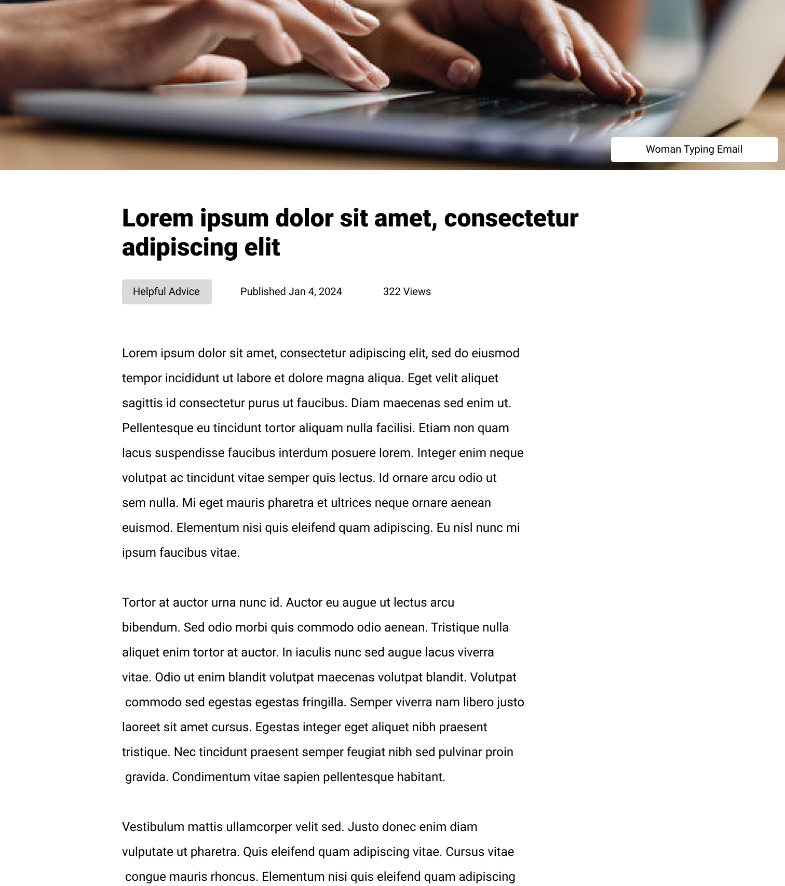

# Project 3: Blog Page

For this assignment, you will practice implementing a mock up into code. This time you will write both your CSS and HTML from scracth to create a blog page that looks similar to the image shown below.

### For the HTML
Make sure you keep in mind the importance of semantic elements and choose appropriate tags for each piece of content on your page. 

You can use Josh's Starter Template. 

### For the CSS
You will need to use multiple layout modes to complete this project. While there are multiple ways to accomplish this layout with CSS, try to use a combination of `positioned`, `flow`, and `flexbox` layout modes, since we have discussed those in class. 

You can use Josh's CSS Reset for some sensible defaults. 

## Goal

Your finished project should be something similar to the image shown below. 

You are allowed to take creative liberties with the images, text content, font selection, colors, etc. to create your own version of the project, but the overall layout should be the same (since that is what we are practicing with this project). 

## Submission
Submit a zip file with all necessary files to Canvas. 

## Reading and Resources
If you're feeling lost, make sure you have completed the recommended readings for this week listed in the [course schedule](https://profstudebaker.notion.site/Interterm-Schedule-Intro-to-Web-Engineering-c8a0830956cb40e688eb2cd34401a3a3). They will help you complete this assignment!
